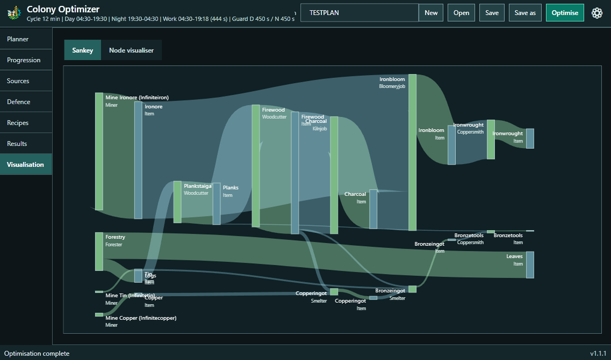

<p align="center">
  
</p>

# Colony Optimiser

Colony Optimiser is a Windows desktop planner for [Colony Survival](https://github.com/pipliz/ColonySurvival). Tell it what you want to produce and it calculates the jobs, ingredients, tools, area jobs, and defence ammunition needed for one production cycle.

It is an independent community project and is not affiliated with Pipliz.

## Features

- Optimise production targets per second, minute, or game cycle.
- Account for unlocked sciences, available tools, alternate recipes, efficiency, and spare capacity.
- Model crop farms, forestry, miners by mined resource, tool replacement, guards, traps, and defence ammunition.
- Inspect the result as tables, an interactive Sankey diagram, or a node graph.
- Save plans locally and optionally preselect progression from a read-only Colony Survival save.



## Download and install

1. Open this repository's [Releases](../../releases) page.
2. Download `ColonyOptimizer-<version>-Setup.exe` for the normal Windows installation. It installs under Program Files and appears in **Installed apps**, from which it can be uninstalled normally.
3. Alternatively, download `ColonyOptimizer-<version>-win-x64.msi` for managed or scripted deployment, or `ColonyOptimizer-<version>-win-x64.zip` for a portable copy.
4. We recommend downloading the matching `.sha256` file for the chosen asset. Do not download the automatically generated `Source code` archives.
5. Run the setup program or MSI. For the portable ZIP, extract it somewhere you can write to and run `ColonyOptimizer.exe`.

The download includes the .NET runtime, so .NET, Python, and Steam do not need to be installed separately. It also includes Microsoft's small WebView2 online bootstrapper. WebView2 is already present on Windows 11 and most up-to-date Windows 10 installations; if it is missing, Colony Optimiser downloads and installs it automatically the first time you open the **Visualisation** tab. Keep an internet connection until that one-time step completes. SmartScreen can be cautious about new unsigned applications; only run a copy obtained from this repository's Releases page. Check the accompanying checksum if you want to confirm that the download arrived unchanged.

### Check the download (OPTIONAL)

In the folder containing the download, right-click and choose **Open in Terminal**, then run:

```powershell
Get-FileHash .\ColonyOptimizer-<version>-Setup.exe -Algorithm SHA256
```

Compare the displayed hash value with the value in the matching `.sha256` file from the same release. The values must match. Substitute the MSI or ZIP filename if you chose that asset.

## First use

On first start, Colony Optimiser searches the usual Steam library locations for Colony Survival saves and lets you choose a world. You can skip this and use the planner without linking a save. If you link a world before loading game data, the link is retained and its progression imports automatically once data is available when there is no plan to preserve.

To obtain recipe data, open the settings cog and either select your installed Colony Survival game-data folder or use the in-app public-data download. The app reads a selected `world.sqlite3` save to preselect completed sciences and available tools. For multiplayer, this works when you host the world locally, can access the dedicated server's save, or have a copy of that server's `world.sqlite3`; joining a remote server does not give the app access to its save. In an accessible multiplayer save, choose a colony group under **Import scope**, then select **Import progression**. **All colony groups** remains the default to preserve earlier combined-import behaviour. A specific group is remembered only when the save exposes a stable group ID; otherwise select it again next time. Remote players without the server save must configure progression manually. It never changes your save file or game installation.

To create a plan:

1. In **Planner**, choose an output, enter an amount and unit, then add it to the plan. A guard or trap requirement can also be optimised on its own.
2. Set sciences, tools, area-job capacity, defence, and recipe choices as required.
3. Select **Optimise**.
4. Review jobs, inputs, tools, and total outputs in **Results**. The food indicator beside the worker and machine-block summary compares planned meal output with one meal per game day for every planned production worker and guard: green is above 110%, amber is 100–110%, and red is below 100%. Hover it for the meal surplus or shortfall. Existing or idle colonists are not included. Miner entries are listed separately for each mined resource. The **Visualisation** tab provides an interactive Sankey and node graph; drag empty space to pan, drag nodes to arrange them, and use the mouse wheel to zoom. In **Node visualiser**, choose a rightward or downward layout and tune node and layer spacing. Recipe nodes show their required job-block count; balanced intermediate items are collapsed, while genuine surplus remains visible as an output node.

**New** creates a completely blank plan: it clears targets, progression, area capacity, defence, recipe policies, solver settings, and timing overrides. Plans are saved as `.colonyplan` files. The last opened or saved plan is restored when the application next starts. When a plan was made with materially different game data, the app opens it but warns that its results may differ. Uninstall keeps plan files by default. Its optional removal choice deletes only `.colonyplan` files recorded as the last-opened plan or in the app's Recent plans list.

## Game compatibility

Colony Optimiser loads recipes and timing dynamically rather than embedding one fixed set of Colony Survival values. Each release is nevertheless tested against a specific public upstream revision, recorded in [Game Data Validation](docs/GAME_DATA_VALIDATION.md). Unknown JSON fields are reported as diagnostics where possible, but structural game-data changes can require an application update.

## Privacy and safety

- The app works locally and has no telemetry or sign-in.
- Network access can occur when you select **Download latest public data**, which downloads public Colony Survival data and commit information from GitHub, or when you first open **Visualisation** and the bundled Microsoft WebView2 bootstrapper needs to install or repair its runtime. The app does not check for updates automatically.
- Game saves are opened read-only. Do not attach save files to bug reports unless requested directly.
- Settings, cached public game data, and logs are kept under your Windows local app-data folder. Delete the `ColonyOptimizer` folder there to reset the app.
- Download updates only from this repository's Releases page. Verifying the SHA-256 checksum is recommended, particularly for an unsigned release.

Please report vulnerabilities privately as described in [SECURITY.md](SECURITY.md). For ordinary bugs or requests, use the repository's [issue tracker](../../issues) and include the app version, a short description, and reproducible steps.

## Inspiration

The idea for Colony Optimiser was inspired by [Factory Calculator](https://factorycalculator.com/) and [Satisfactory Tools](https://www.satisfactorytools.com/1.0/production). I wanted a similar production-planning experience for Colony Survival, but web applications were outside my usual experience, so I built it as a downloadable local Windows application instead. This also keeps plans and save-derived data on your own computer.

## For contributors

Technical material is kept out of the user guide. Start with [CONTRIBUTING.md](CONTRIBUTING.md) for local build/run and test instructions, then see the [architecture](docs/ARCHITECTURE.md), [solver model](docs/SOLVER_MODEL.md), [game-data validation](docs/GAME_DATA_VALIDATION.md), [release instructions](docs/RELEASING.md), and [changelog](CHANGELOG.md). Bundled visualisation-library notices are in [THIRD_PARTY_NOTICES.md](THIRD_PARTY_NOTICES.md).

## Licence

This project is released under the [MIT Licence](LICENSE).
